

    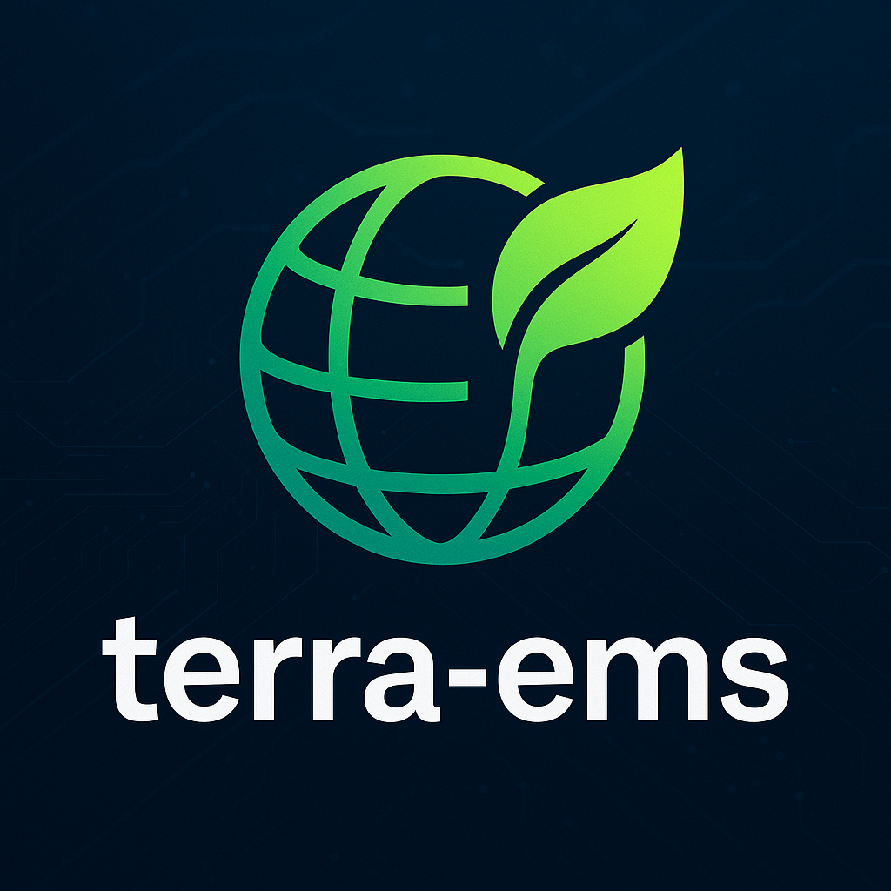

<h1 style="text-align: center; margin: 30px 0 30px; font-weight: bold;">泰若能源管理系统</h1>

基于SpringBoot和若依框架开发

泰若平台后台展示&接口已完全开源，代码完备，功能齐全，运行正常

通过本项目，学习者可以掌握能源管理行业的功能和业务，以及技术架构。

    <a href='https://gitee.com/dengxp/terra-ems/stargazers'></img></a>
    <a href='https://gitee.com/dengxp/terra-ems/members'></img></a>

## 介绍
该系统通过智能化采集企业水、电、气、热等能耗数据，构建完整的能源管理体系，
精准识别能源浪费问题（如跑冒滴漏），为企业节能降耗提供科学依据。同时，
系统可进一步实现碳跟踪、碳盘查、碳交易及碳汇报的全流程管理，
助力企业绿色低碳转型，推动国家“碳达峰、碳中和”目标实现。

适用场景：政府、园区、企业、工矿、公共建筑等各类用能单位。

## 【注意】完整泰若管理平台包含三个部分，本仓库只包含泰若平台后台管理端
##### 1. 泰若平台后台管理端：也即本项目泰若平台后台展示部分，代码完备，运行正常。通过本项目，学习者可以掌握能源管理行业的功能和业务，以及技术架构。
##### 2. 数据采集程序：也即mqtt➡️时序库功能，可参考thingsjs等知名项目，或者自己用netty自己实现。
##### 3. 数据清洗服务：也即时序库➡️关系库，学习者可以使用java自带的XXL job等计划任务工具自己按照业务功能，来实现数据清洗服务。

## 文档--均在wiki目录
### github wiki地址：https://github.com/dengxp/terra-ems/wiki
### gitee wiki地址：https://gitee.com/dengxp/terra-ems/wikis/

## 社区版-功能列表
1.  首页看板 **已完成**
2.  实时数据监测 **已完成**  
    2.1.  实时数据查看 **已完成**  
    2.2.  组态图分析（svg 图绑定）**已完成**
3. 历史点位分析 **已完成**
4. 综合指标分析 **已完成**  
   4.1.  综合指标分析（日）**已完成**  
   4.2.  综合指标分析（月）**已完成**  
   4.3.  综合指标分析（年）**已完成**
5. 重点设备分析  **已完成**    
   5.1.  重点设备分析（日）**已完成**  
   5.2.  重点设备分析（月）**已完成**    
   5.3.  重点设备分析（年）**已完成**
6. 工序能耗分析 **已完成**  
   6.1.  工序能耗分析（日）**已完成**  
   6.2.  工序能耗分析（月）**已完成**    
   6.3.  工序能耗分析（年）**已完成**
7. 尖峰平谷分析 **已完成**  
   7.1.  尖峰平谷配置 **已完成**  
   7.2.  尖峰平谷数据 **已完成**
8. 能耗对比分析（各能源品种）**已完成**  
   8.1.  电同环比分析 **已完成**      
   8.2.  水同环比分析 **已完成**       
   8.3.  其他能源品种分析 **已完成**
9. 智能报警 **已完成**  
   9.1.  报警分析 **已完成**        
   9.2.  报警配置 **已完成**
10. 数据补录 **已完成**
11. 节能项目管理 **已完成**
12. 知识库 **已完成**
13. 设备档案管理 **已完成**
14. 模型配置管理（计算模型等） **已完成**
15. 基础数据管理（字典、能源类型等） **已完成**
16. 系统管理（用户、角色、权限等） **已完成**
17. 建筑能耗分析（支路、分项） **已完成**

## 增强版-功能列表
1. 单耗分析
2. 计划与实绩
3. 用能考核
4. 用能对标
5. 建筑能耗空调节能
6. 能源平衡分析
7. 能源对标分析
8. 空压机重点设备节能内容
9. 碳盘查、碳路径、碳排放因子因子相关内容
10. 源网荷储（微电网）相关功能
11. 低碳园区相关
12. 自定义报表
13. 能源成本分析
14. 光伏运维监控
15. 充电运营平台

## 框架：

基于SpringBoot的若依框架 易读易懂、界面简洁美观。支持深色&浅色两种风格切换（演示系统右上角）   
关系数据库：postgresql（mysql需自行适配，mysql性能太差了）   
时序数据库：influxdb 2.7+  
中间件：redis  
VUE版本：VUE 3

## 特色：数据驱动的计算模型和业务模型配置
1.  支持动态点位配置。
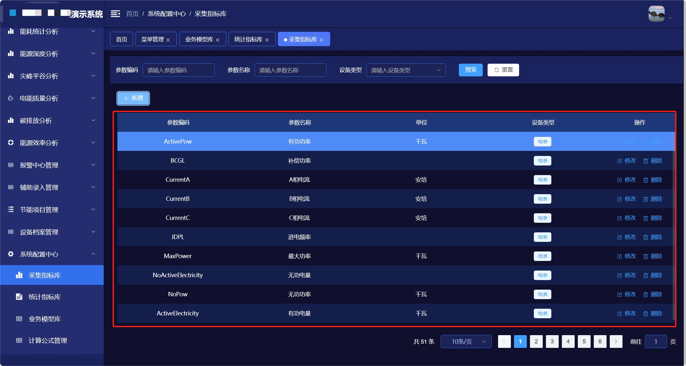
2.  支持计算公式。
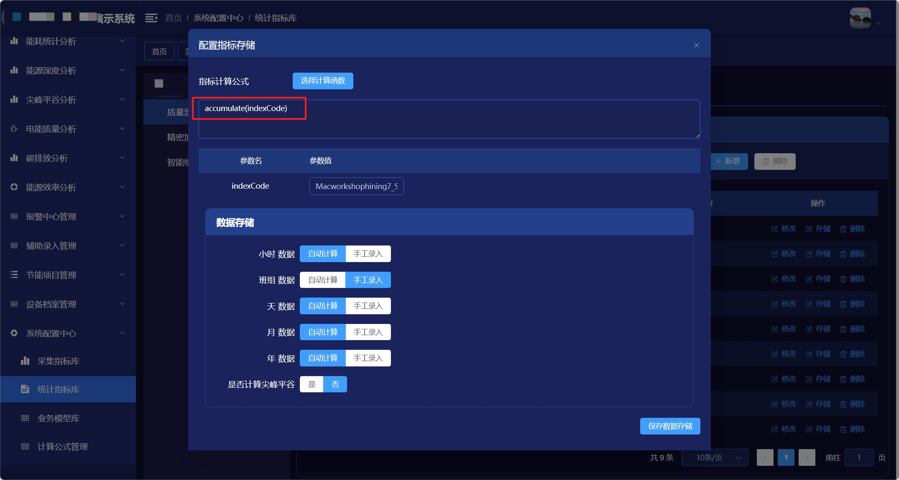
3.  支持模型配置、包括数据模型、业务模型。
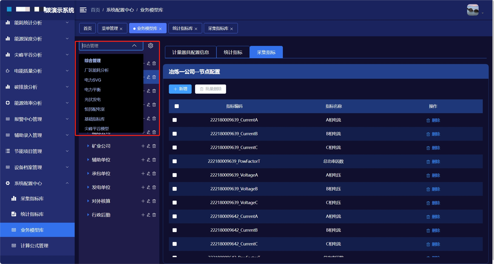
4.  复杂项目底层代码&数据结构完全不需要变化，可快速交付实施。
5.  已完成标准化的网关&电表等采集设备对接，快速为客户软硬件一体化交付。

## 亮点功能
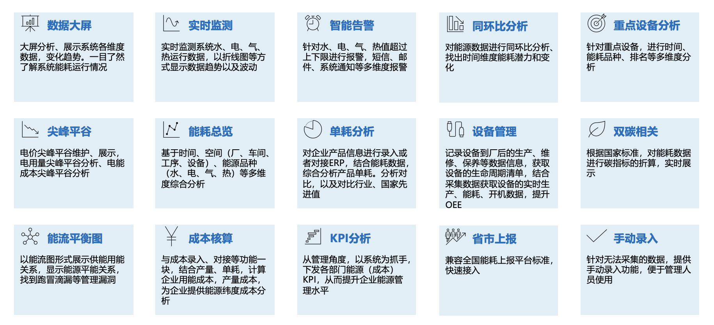

## UI展示（平台分深色和浅色两种风格切换）

    登录页面
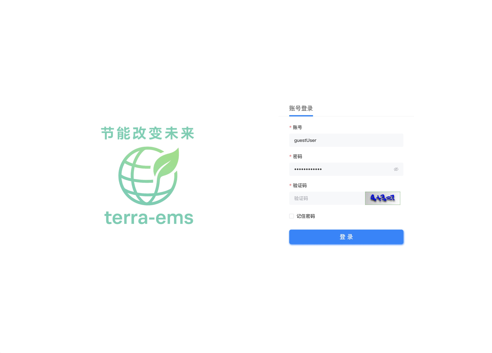

    首页-浅色 
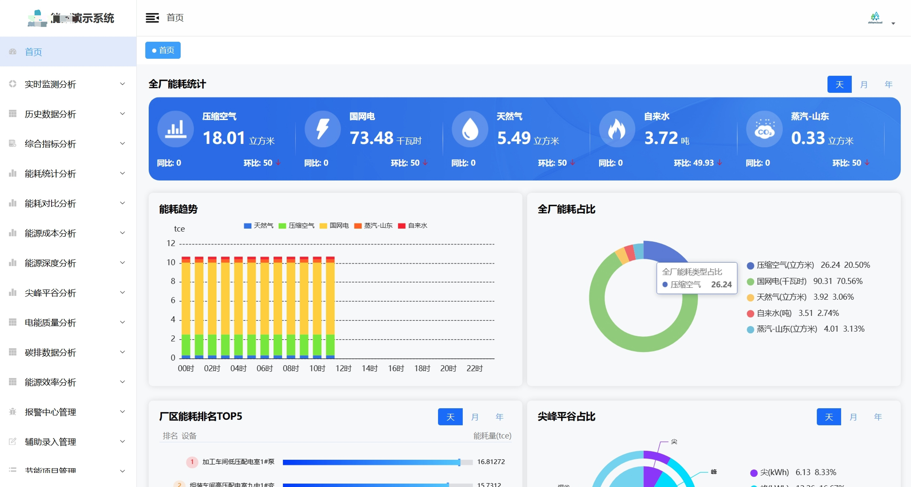

    首页-深色 
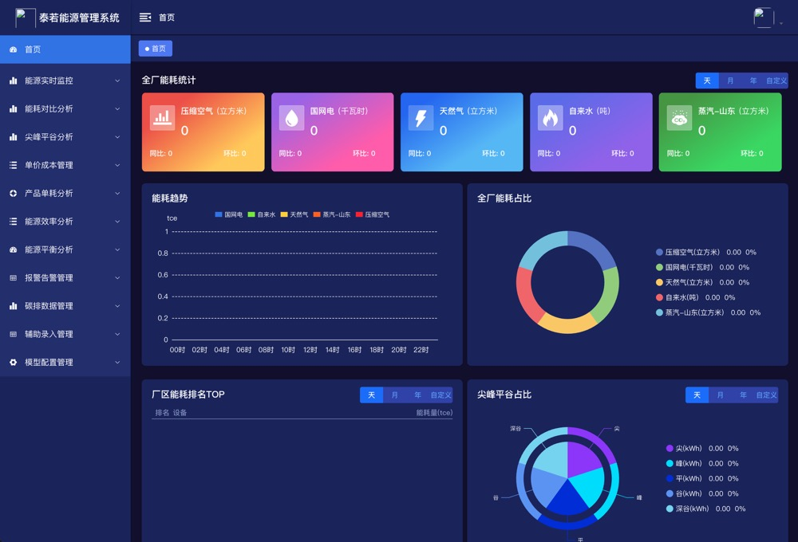

    实时监测-浅色 

    实时监测-深色 
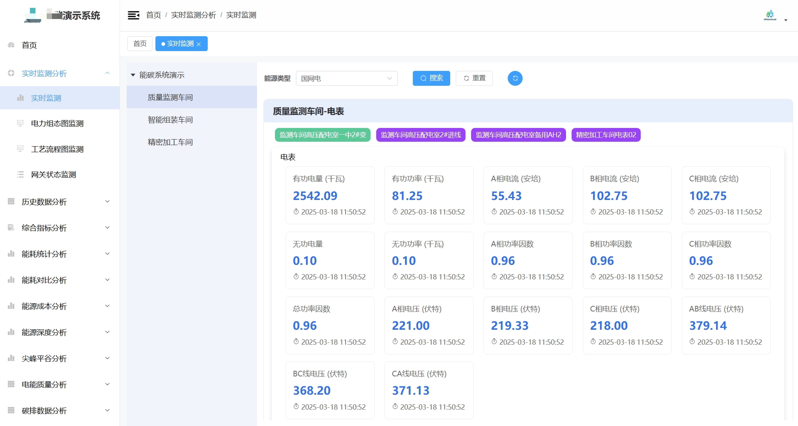

    尖峰平谷-浅色 
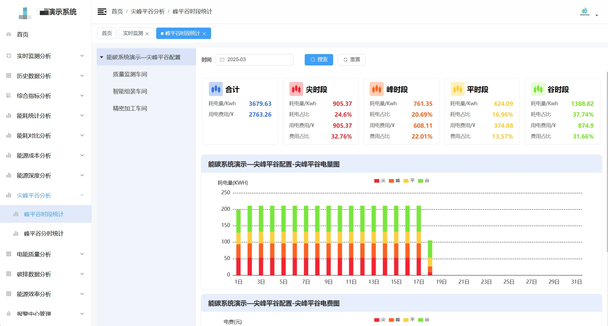

    尖峰平谷-深色 
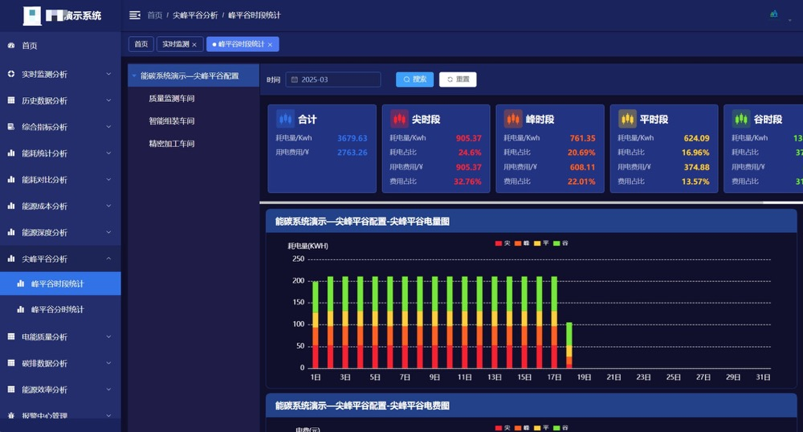

    区域能耗-浅色 
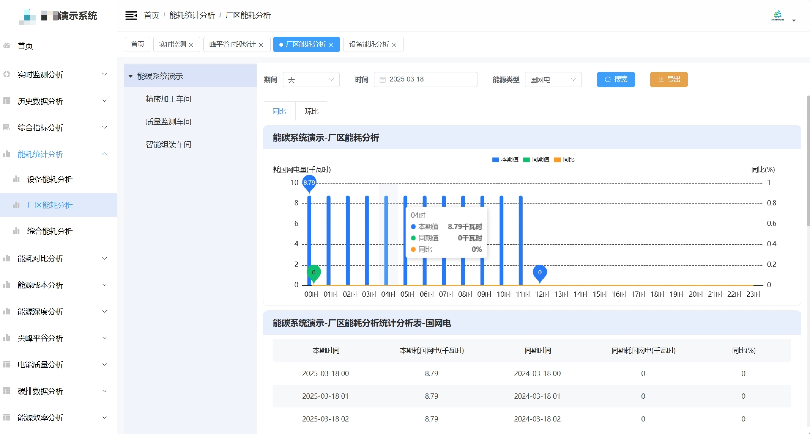

    区域能耗-深色 

## 业务架构
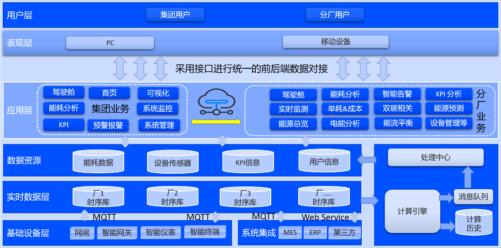

## 技术架构
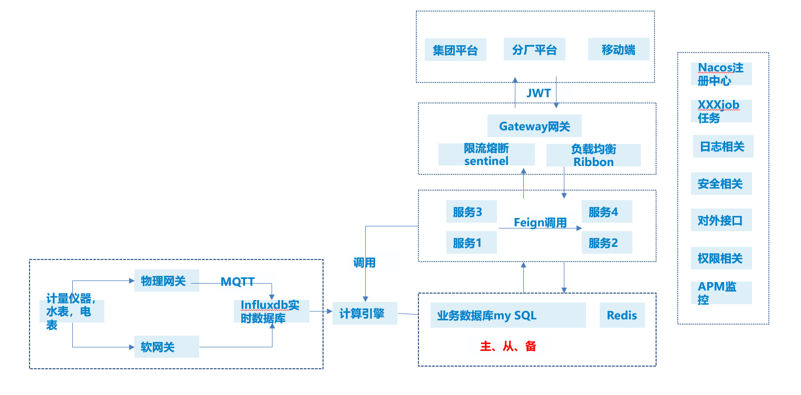
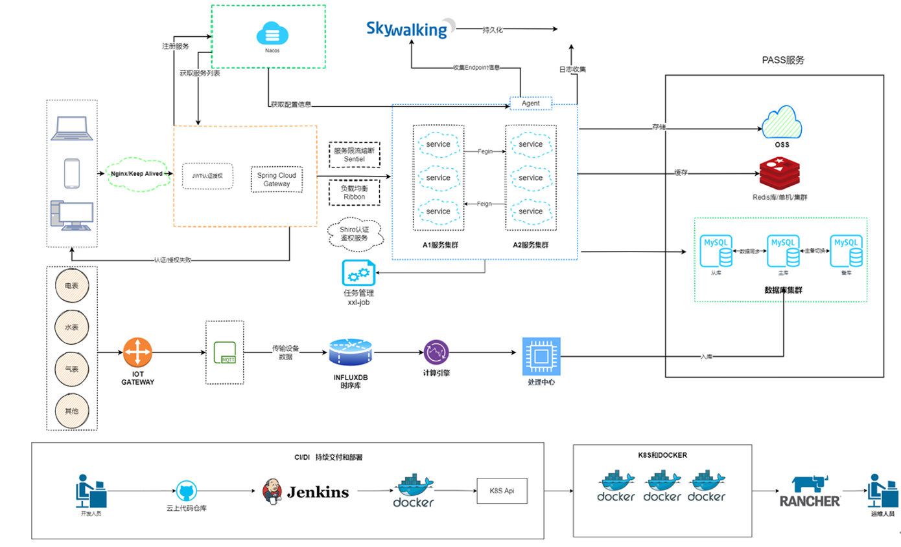

## 参与贡献

1.  Fork 本仓库
2.  新建 Feat_xxx 分支
3.  提交代码
4.  新建 Pull Request

## 联系方式
qq: 67493282
